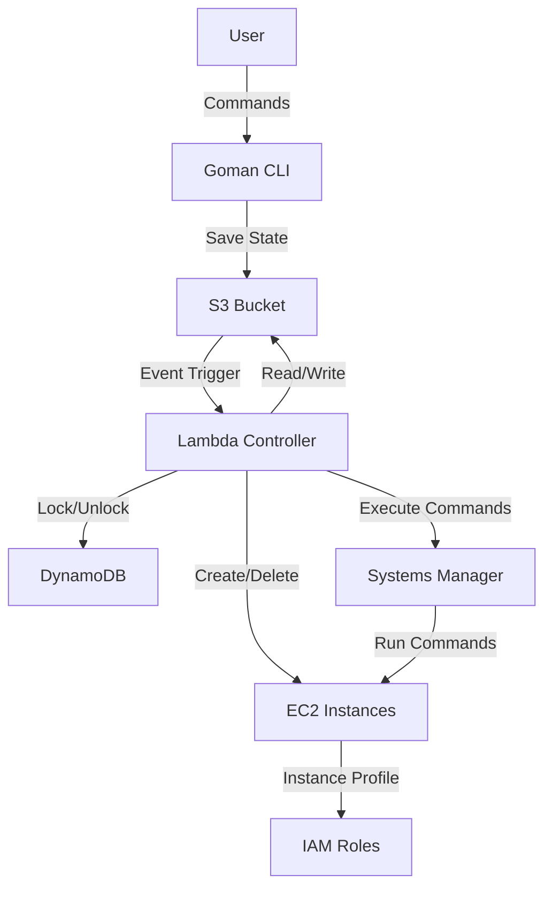

# Goman Architecture

## Overview

Goman is a serverless Kubernetes cluster management tool that leverages AWS services to provide automated cluster lifecycle management without requiring dedicated infrastructure. It uses a reconciliation pattern with Lambda functions triggered by S3 events to maintain desired cluster state.

## Core Components

### 1. Local CLI (`goman`)
- **Purpose**: User interface for cluster management
- **Technologies**: Go, Bubble Tea (TUI framework)
- **Key Features**:
  - Interactive TUI for cluster operations
  - Initialization command (`goman init`) for AWS infrastructure setup
  - Direct cluster creation/deletion commands
  - Hidden cleanup command (`goman uninit`) for testing

### 2. AWS Lambda Controller
- **Purpose**: Reconciliation engine for cluster state
- **Trigger**: S3 event notifications on `clusters/*.json` files
- **Responsibilities**:
  - Create EC2 instances for cluster nodes
  - Delete instances when clusters are removed
  - Maintain cluster state consistency
  - Handle distributed locking via DynamoDB

### 3. Storage Layer (S3)
- **Bucket**: `goman-{accountID}`
- **Structure**:
  ```
  clusters/
    └── {cluster-name}.json  # Individual cluster state files
  ```
- **Features**:
  - Event-driven Lambda triggers
  - State persistence
  - No versioning (simplified design)

### 4. Distributed Locking (DynamoDB)
- **Table**: `goman-resource-locks`
- **Purpose**: Prevent concurrent modifications
- **Key Structure**: Cluster name as partition key

### 5. Remote Execution (Systems Manager)
- **Purpose**: Agentless EC2 management
- **Components**:
  - SSM instance profile for EC2 instances
  - SendCommand API for remote execution
  - No SSH keys required

## Architecture Flow



## Initialization Process

When running `goman init`:

1. **S3 Bucket Creation**
   - Creates `goman-{accountID}` bucket
   - Configures event notifications for Lambda

2. **Lambda Deployment**
   - Creates execution role with least-privilege policies
   - Deploys controller function
   - Sets up S3 trigger for `clusters/*.json` pattern

3. **DynamoDB Table**
   - Creates `goman-resource-locks` table
   - Configures for distributed locking

4. **IAM Resources**
   - Lambda execution role with:
     - CloudWatch Logs access
     - S3 read/write for state bucket
     - EC2 instance management
     - DynamoDB locking operations
     - SSM command execution
   - SSM instance profile for EC2 instances

## Security Model

### IAM Policies

1. **Lambda Execution Role**:
   ```
   - AWSLambdaBasicExecutionRole (CloudWatch Logs)
   - Custom policy with:
     - S3: Get/Put/Delete on goman bucket only
     - EC2: Instance management operations
     - DynamoDB: Operations on locks table only
     - SSM: SendCommand for remote execution
     - IAM: PassRole for SSM instance profile only
   ```

2. **EC2 Instance Profile**:
   ```
   - AmazonSSMManagedInstanceCore (SSM agent communication)
   ```

### Security Features
- No SSH keys or key pairs
- Least-privilege IAM policies
- Resource-scoped permissions
- Agentless management via SSM

## State Management

### Cluster State File Format
```json
{
  "cluster": {
    "id": "k3s-1234567890",
    "name": "my-cluster",
    "status": "running",
    "created_at": "2025-08-10T10:00:00Z",
    "updated_at": "2025-08-10T10:05:00Z",
    "master_nodes": [...],
    "worker_nodes": [...]
  },
  "instance_ids": {
    "master-0": "i-abc123",
    "worker-0": "i-def456"
  },
  "security_groups": ["sg-xxx"],
  "vpc_id": "vpc-yyy",
  "subnet_ids": ["subnet-zzz"],
  "metadata": {
    "reconcile_needed": true,
    "last_reconciled": "2025-08-10T10:05:00Z"
  }
}
```

### Reconciliation Loop

1. **State Change**: User modifies cluster via CLI
2. **S3 Write**: State saved to `clusters/{name}.json`
3. **Event Trigger**: S3 notifies Lambda of file change
4. **Reconciliation**: Lambda reads desired state and reconciles
5. **Update State**: Lambda updates state file with actual state
6. **Requeue**: If needed, Lambda requeues for future reconciliation

## File Naming Conventions

- **S3 Path**: `clusters/{cluster-name}.json`
- **Lambda Function**: `goman-cluster-controller`
- **DynamoDB Table**: `goman-resource-locks`
- **S3 Bucket**: `goman-{accountID}`
- **IAM Roles**: 
  - `goman-lambda-role-{accountID}`
  - `goman-ssm-instance-role`

## Development

### Building
```bash
# Build CLI
task build:ui

# Build Lambda
task build:lambda:aws

# Build everything
task build
```

### Testing
```bash
# Initialize infrastructure
./goman init

# Clean up (hidden command)
./goman uninit

# View Lambda logs
task lambda:logs
```

## Key Design Decisions

1. **Serverless Architecture**: No dedicated infrastructure to manage
2. **Event-Driven**: S3 events trigger reconciliation automatically
3. **Agentless**: Systems Manager instead of SSH
4. **Single File Format**: JSON only (no YAML)
5. **Name-Based Paths**: Use cluster names, not IDs
6. **Clean Paths**: Direct `clusters/` prefix without nesting
7. **Least Privilege**: Minimal IAM permissions
8. **No Backward Compatibility**: Clean slate approach

## Future Enhancements

- Multi-region support
- Cluster backup/restore
- Cost optimization features
- Auto-scaling capabilities
- Monitoring dashboard
- GitOps integration